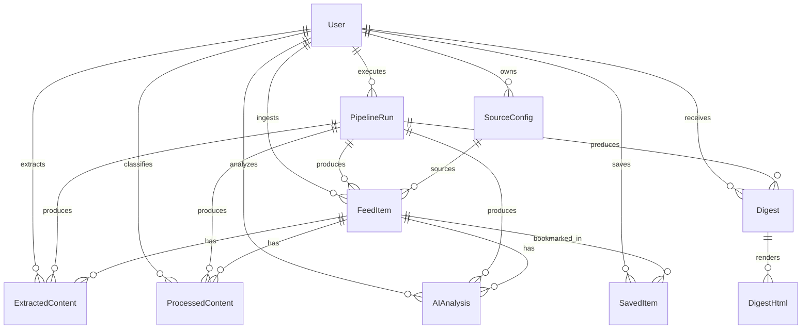

# Multi-tenant Data Model

## System Overview
- Multi-tenant pipeline: each run is scoped to a `userId`, pulls that user's sources, and writes intermediates and digests tied to both `userId` and a `pipelineRunId`.
- Pipeline step outputs map to persisted tables: Step1 → `PipelineRun`, `FeedItem`; Step2 → `ExtractedContent`; Step3 → `ProcessedContent`; Step4 → `AIAnalysis`; Step5 → `Digest` (+ `DigestHtml` artifact), plus optional `ScoringAudit`.
- Source configuration is user-owned (`SourceConfig`) and can represent RSS feeds or Google Custom Search queries.
- Saved items (`SavedItem`) are user-specific and exempt from automated retention cleanup; retention cleanup acts on time-varying tables by `createdAt`/`expiresAt`.
- Auditability: every table includes `createdAt` (and often `updatedAt`) to trace when data entered the system; `PipelineRun` records overall run status, and optional `RetentionAuditLog` records cleanup actions.

## Entity List and Purpose
- **User**: tenant identity (slug/email/status) that owns sources, runs, data, and outputs.
- **SourceConfig**: per-user feed/search configuration (type, URL/query, categories, active flags).
- **PipelineRun**: a single execution of the pipeline for a user (timestamps, status, error, step markers).
- **FeedItem**: raw fetched item metadata linked to source/run/user (URL, title, published).
- **ExtractedContent**: normalized/full text extracted from the feed item (content, comments URL, published).
- **ProcessedContent**: classified media and processing flags (mediaType, mediaUrl, shouldSkipAI, normalized content references).
- **AIAnalysis**: AI-generated summary/sentiment/positivity derived from processed content.
- **Digest**: per-category (or configured scope) digest generated in Step5 for a run; stores the full JSON payload (items, categories, summaries), config, prompt, theme, and status.
- **DigestHtml**: rendered HTML artifact for a digest (per format, e.g., web/email).
- **SavedItem**: user-curated list of feed items/summaries to persist beyond retention windows.
- **RetentionAuditLog** (optional): record of retention cleanup actions for auditability.
- **ScoringAudit** (optional but recommended): preserves Step5 scoring/ranking inputs/outputs for transparency.

## Table Definitions with Fields/Types/PK/FK

### User
- `id` (pk, text/uuid)  
- `slug` (unique, text), `email` (text), `displayName` (text, nullable)  
- `isActive` (bool, default true)  
- `createdAt` (timestamptz), `updatedAt` (timestamptz)

### SourceConfig
- `id` (pk, uuid), `userId` (fk → User.id)  
- `type` (enum: `rss` | `google`), `name` (text), `url` (text, nullable), `query` (text, nullable)  
- `categories` (text[]), `language` (text, nullable), `isActive` (bool, default true)  
- `lastFetchedAt` (timestamptz, nullable), `createdAt` (timestamptz), `updatedAt` (timestamptz)  
- Unique: (`userId`, `type`, `url`/`query`) to avoid duplicates.

### PipelineRun
- `id` (pk, uuid), `userId` (fk → User.id)  
- `startedAt` (timestamptz), `completedAt` (timestamptz, nullable), `status` (enum: running/succeeded/failed)  
- `stepCompleted` (int, nullable), `error` (text/json, nullable), `notes` (text, nullable)

### FeedItem
- `id` (pk, uuid), `userId` (fk → User.id), `sourceConfigId` (fk → SourceConfig.id), `pipelineRunId` (fk → PipelineRun.id)  
- `externalId` (text, nullable) to dedupe per source, `title` (text), `url` (text), `publishedAt` (timestamptz, nullable)  
- `rawFeed` (jsonb, optional), `siteName` (text, nullable), `commentsUrl` (text, nullable)  
- `createdAt` (timestamptz), `updatedAt` (timestamptz, nullable)
- Unique: (`userId`, `sourceConfigId`, `url`) or (`userId`, `sourceConfigId`, `externalId`) for idempotency.

### ExtractedContent
- `id` (pk, uuid), `feedItemId` (fk → FeedItem.id), `userId` (fk → User.id), `pipelineRunId` (fk → PipelineRun.id)  
- `content` (text), `publishedAt` (timestamptz, nullable), `commentsUrl` (text, nullable)  
- `createdAt` (timestamptz), `updatedAt` (timestamptz, nullable)

### ProcessedContent
- `id` (pk, uuid), `feedItemId` (fk → FeedItem.id), `userId` (fk → User.id), `pipelineRunId` (fk → PipelineRun.id)  
- `mediaType` (enum: text/image/video/short-text/etc.), `mediaUrl` (text, nullable), `shouldSkipAI` (bool), `normalizedUrl` (text, nullable)  
- `createdAt` (timestamptz), `updatedAt` (timestamptz, nullable)

### AIAnalysis
- `id` (pk, uuid), `feedItemId` (fk → FeedItem.id), `userId` (fk → User.id), `pipelineRunId` (fk → PipelineRun.id)  
- `summary` (text), `hasSummary` (bool), `isPositive` (bool), `sentimentScore` (numeric, nullable), `model` (text)  
- `createdAt` (timestamptz), `updatedAt` (timestamptz, nullable)

### Digest
- `id` (pk, uuid), `userId` (fk → User.id), `pipelineRunId` (fk → PipelineRun.id)  
- `status` (text, default `ready`), `payload` (jsonb: full digest content including categories/items/summaries/usedItemIds), `config` (jsonb), `customPrompt` (text), `theme` (jsonb), `error` (jsonb, nullable)  
- `generatedAt` (timestamptz), `expiresAt` (timestamptz, nullable), `createdAt`/`updatedAt` (timestamptz)

### DigestHtml
- `id` (pk, uuid), `digestId` (fk → Digest.id), `format` (text, default `web`), `html` (text)  
- `generatedAt` (timestamptz), `createdAt`/`updatedAt` (timestamptz)

### SavedItem
- `id` (pk, uuid), `userId` (fk → User.id), `feedItemId` (fk → FeedItem.id)  
- `savedSummary` (text, nullable), `notes` (text, nullable)  
- `createdAt` (timestamptz), `updatedAt` (timestamptz, nullable)
- Unique: (`userId`, `feedItemId`) to keep idempotent saves.

### RetentionAuditLog (optional)
- `id` (pk, uuid), `tableName` (text), `userId` (fk → User.id, nullable), `deletedCount` (int), `retentionWindowMonths` (int)  
- `ranAt` (timestamptz), `notes` (text, nullable)

### ScoringAudit (optional)
- `id` (pk, uuid), `userId` (fk → User.id), `pipelineRunId` (fk → PipelineRun.id)  
- `label` (text/category), `customInstructions` (text), `selectedItems` (jsonb), `scoredItems` (jsonb), `topKPerSource` (int)  
- `scoredAt` (timestamptz)

- **Step1: Fetch sources** → `PipelineRun` (started), `FeedItem` (raw items, source metadata, dedupe), optional update `SourceConfig.lastFetchedAt`.
- **Step2: Extract content** → `ExtractedContent` rows per feed item with full text/comments.
- **Step3: Process content** → `ProcessedContent` rows with media classification and skip flags.
- **Step4: AI analysis** → `AIAnalysis` rows containing summaries/positivity per feed item.
- **Step5: Generate digests** → `Digest` (per category/run/user) storing full JSON payload/config/prompt/theme and used items, plus `DigestHtml` (rendered artifacts). `ScoringAudit` records ranking inputs/outputs. `SavedItem` is populated by user actions, not the pipeline, but links to the same feed items for retention.

## ERD Diagram (Mermaid)

## Retention Rules
- Retention window: rows older than `RETENTION_MONTHS` (e.g., 3–6 months) are eligible for deletion across time-varying tables (`FeedItem`, `ExtractedContent`, `ProcessedContent`, `AIAnalysis`, `Digest`, `DigestHtml`, `ScoringAudit`) using `createdAt`/`generatedAt` or `expiresAt` if present.
- Saved items exemption: any `FeedItem` linked to a `SavedItem` (and its dependent `ExtractedContent`/`ProcessedContent`/`AIAnalysis` entries) must be preserved regardless of age.
- Deletion order to satisfy FK constraints: delete `DigestHtml` → `Digest` → `AIAnalysis` → `ProcessedContent` → `ExtractedContent` → `FeedItem`; `ScoringAudit` can be deleted independently; `PipelineRun` can be cleaned after dependent rows are removed.
- Audit: log cleanup actions into `RetentionAuditLog` with counts and window applied; optionally record per-user if scoped.
- Indexing: time-varying tables should include indexes on (`userId`, `createdAt`) to speed up retention queries and per-user reads.
